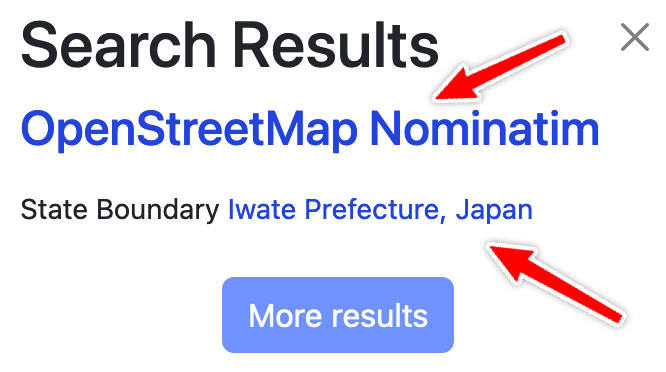

# Debugging international names

If there is an issue about international names not being displayed correctly, first, we need to find **one specific example** and check at which stage does the problem appear.

OpenFreeMap map data is created by the following stack:

**OpenStreetMap data ➔ OpenMapTiles specification ➔ Planetiler**

1. To debug OpenStreetMap data, go to OpenStreetMap.org and search for the query string. For example "Iwate Prefecture" gives these results: [nominatim](https://nominatim.openstreetmap.org/ui/details.html?osmtype=R&osmid=3792412&class=boundary) and [openstreetmap](https://www.openstreetmap.org/relation/3792412)

   

2. Then we need to check what the data is in the generated vector tiles. The best way to do this is to go to [Maputnik editor](https://maputnik.github.io/editor?style=https://tiles.openfreemap.org/styles/bright) and select View / Inspect.

   

3. Then you can search for the little red dot matching your label and make a screenshot.

   

Now we can compare where the naming problem is coming from.

In conclusion: for the **one specific example**, please link the OSM pages and add the inspector screenshot, then we can start with the debugging.

## Next steps

It'd be nice to compare with other OpenMapTiles implementations like [tilemaker](https://github.com/systemed/tilemaker) or the [OpenMapTiles reference](https://github.com/openmaptiles/openmaptiles). I don't have full planet datasets from these implementations currently, so if someone is willing to run one it'd be a great contribution.
